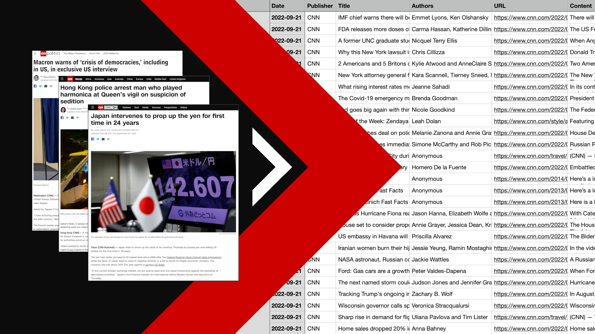

# rss-newsfeed-scraping

This project uses BeautifulSoup to extract the latest articles posted by CNN across their various subdomains.

In a Jupyter notebook we scrape the articles from an RSS newsfeed which contains the latest articles posted by CNN across their various subdomains and then extract the article information and store our results in a csv file.

Each article result will contain -
 - Date 
 - Publilsher
 - Title
 - Author(s)
 - Article URL
 - Content
